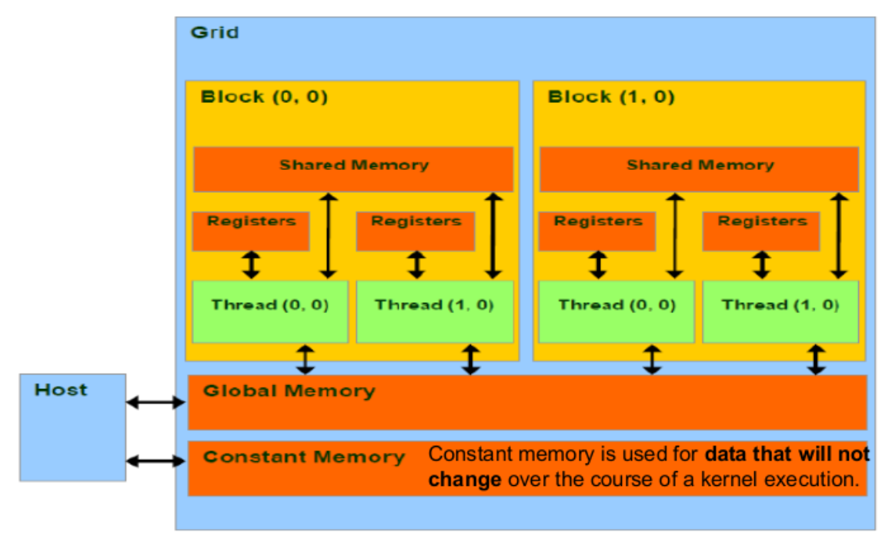

# Programacion Paralela

## Speed Up

```{Python}
 SU = 1/((P/Np) + S)
```

La aceleracion que obtiene una funcion dependiendo de el porcentaje de codigo paralelizable(P), numero de procesadores (Np) y codigo en serie(S).

## Tipos de funciones

- **Funciones distributivas:** Las funciones se pueden dividir en subgrupos y se aplica la funcion a los resultados de los subgrupos.
- **Funciones Algebraica:** La funcion se puede calcular mediante funciones auxiliares aplicadas a los subgrupos de datos.
- **Funciones Holisticas:** La funcoin no se puede calcular mediante funciones auxiliares aplicadas a los subgrupo de datos, **opuesta a la algebraica**. Se podria calcular mediante subfunciones familiares, pero la firma de la funcion o el numero de resultados debe ser igual para que sea **algebraica**, de lo contrario **holistica**.

## CUDA

- **Host = CPU**
- **Device = GPU**

### Organizacion de hilos

- Hilos
- Bloque de hilos (Thread Block)
- Grid

### Memoria

- Memoria por hilo (registers)
- Memoria compartida por bloque de hilos (shared memory)
- Memoria global compartida por todos los hilos con una latencia alta (global memory)
- Memoria constante solo de lectura (tamano pequena, por lo general 64kb) (contant memory)


